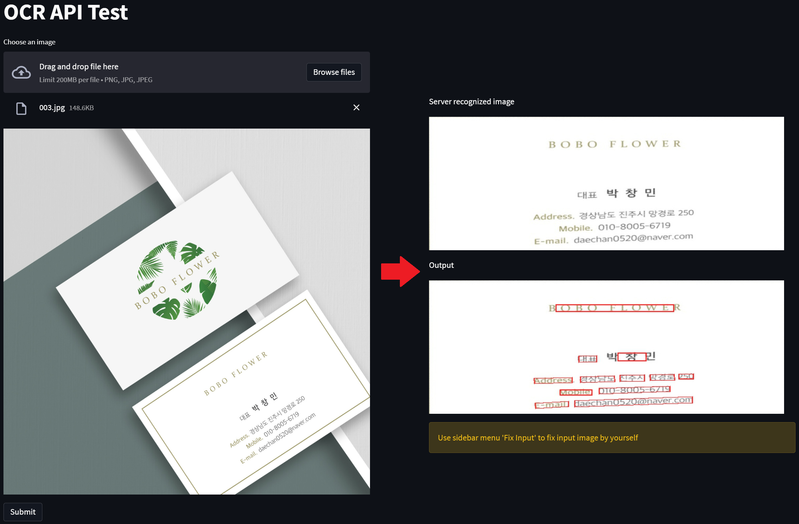
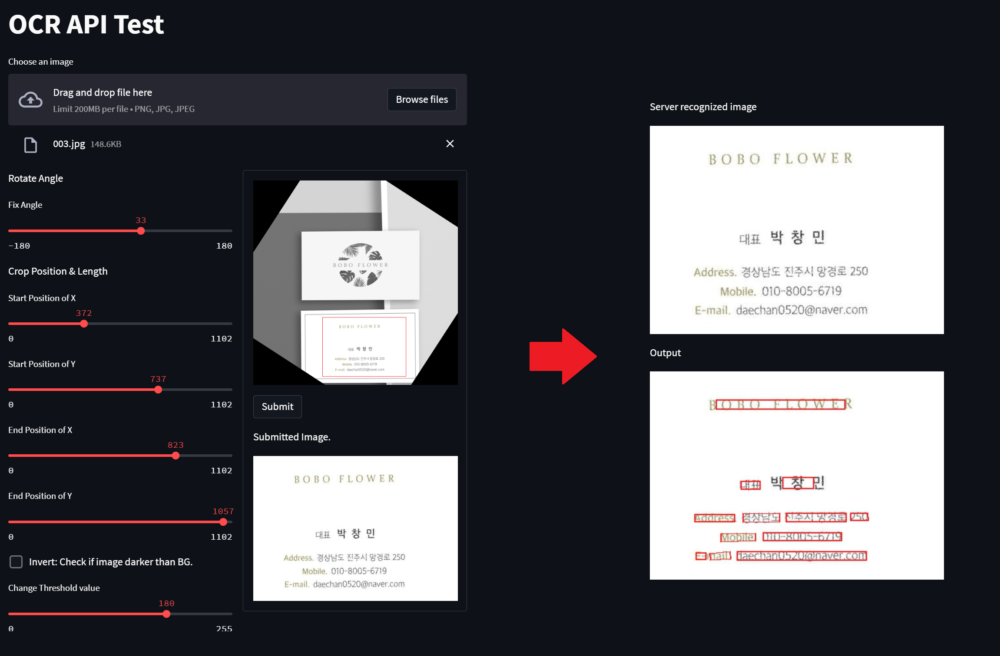

# Front-end

```bash
#requirements
pip install streamlit
```

streamlit을 활용한 front-end입니다.


#### prototype

Sidebar의 select box를 통해 Auto Fix와 Fix Input을 선택할 수 있습니다.
Auto Fix의 경우 이미지가 자동으로 보정됩니다.
Fix Input의 경우 이미지의 각도, crop 위치 및 threshold를 직접 지정하여 제출할 수 있습니다.
두 경우 모두 서버에서 변경된 이미지와 변경된 OCR output을 받아와 표시합니다.


- Auto Fix



- Fix Input


