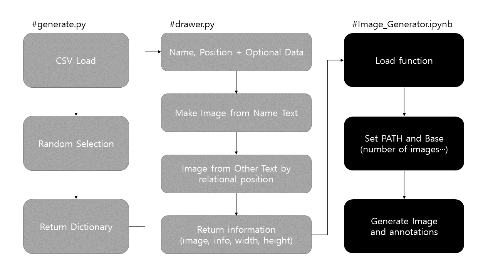

# Image Generator

모델 학습 이미지를 생성하기 위한 이미지 생성 프로그램입니다.

```python
generator/
└── 📂 data/
    ├── 🗒️ *.csv
    │
    📂 font/
    ├── 📝 *.ttf
    │
	📄 __itit__.py
    📄 drawer.py					# image & bbox return
    📄 generate.py					# csv load & random return
    📄 Image_Generator.ipynb		# 이미지 생성용 노트북 파일
    📄 sample.json					# 최초 생성에 사용하는 template json
    │
    └── 📂 results					# 데이터 생성 폴더
    	├── 📂 images				# 이미지 폴더
    	└── 📄 info.json			# annotations
```


### workflow



### caution

1. 데이터 셋 통일을 위해 반드시 팀 내에서 공유된 상태로 사용할 것
2. 너무 긴 문자열 등으로 발생하는 이상 데이터 체크할 것
3. 결과물에 따라 변동 가능성 인지